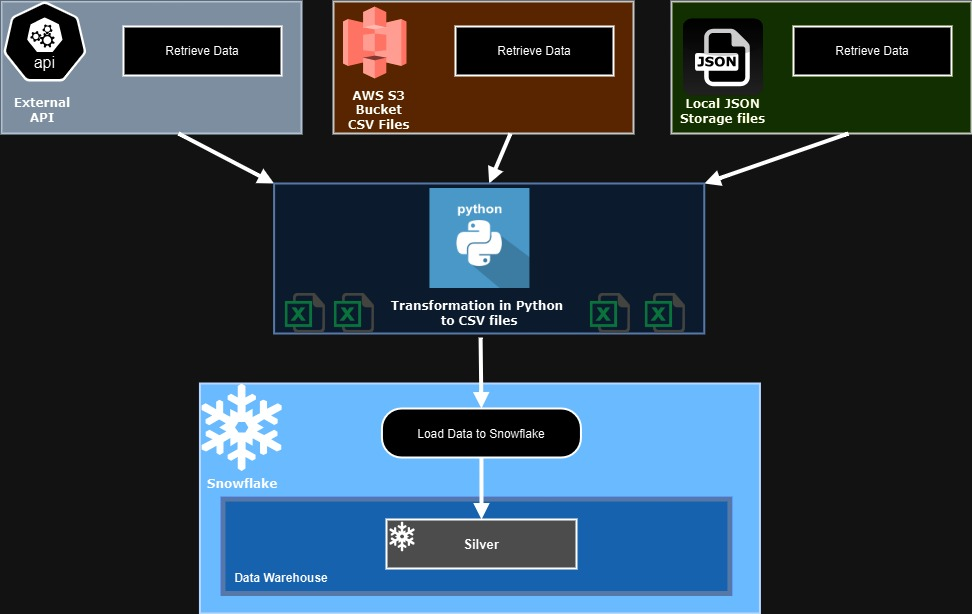

# snowflake-aws-etl-project

Este projeto realiza a extração, transformação e carregamento (ETL) de dados de diferentes fontes para o Snowflake.

## Fontes de Dados

- **API em tempo real:** Dados do mercado financeiro.
- **Bucket no S3:** Arquivos CSV armazenados na AWS S3.
- **Arquivos JSON locais:** Pasta com diversos arquivos JSON adicionados diariamente.

## Estrutura do Projeto

- Arquivos Python para extração das 3 fontes diferentes: extract_api.py; extract_s3.py; extract_local_json.py;
- Arquivo Python para transformação dos dados: transform.py;
- Arquivo para carregamento dos dados: load_snowflake.py;
- Arquivos para execução automática da ETL: run_etl.py.
